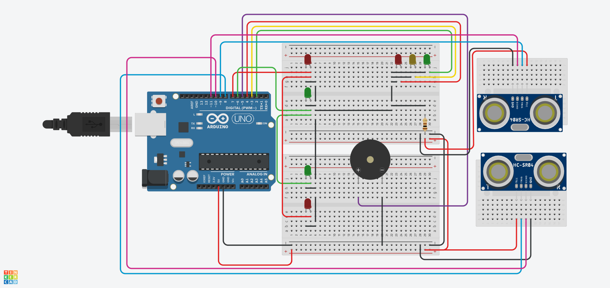

# PedestrianSense

Development of an automatic traffic light with pedestrian detection using Arduino, distance sensors, LEDs and an audible
signal, with automatic adjustment transition in case of presence or absence of pedestrians.

# Description

This work focuses on the development of an automatic signaling system that detects the presence of pedestrians and
adjusts the state of the traffic lights accordingly. The system uses the Arduino Uno microcontroller, ultrasonic sensors
for pedestrian detection, LEDs for the traffic lights and a buzzer for the audible notification when pedestrians are
detected. The goal of the implementation is to reduce unnecessary waiting times, ensuring that drivers do not wait
unnecessarily when there are no pedestrians wishing to cross the road and that pedestrians will have priority to cross
the road.

# Design

[Tinker This](https://www.tinkercad.com/things/7rupZ55A2RG-pedestriansense?sharecode=2-Y8UZJDhC64ENvKhkmB4mk3aNhrKVhh2EfPOBmN8SA)

# Extra files
** The extra files are written in Greek Language.
* [PDF/Text](./assets/PedestrianSense.pdf)
* [PowerPoint/Presentation](./assets/PedestrianSense.pptx)
* [MOV/Demo](./assets/PedestrianSense.mov)

# License

[MIT License](./LICENSE)

# Disclaimer

This project was conducted as part of the course Ρ101: Embedded Systems in the M.Sc. program in Robotics, offered by the
Department of Computer, Informatics and Telecommunications Engineering at the International Hellenic University.